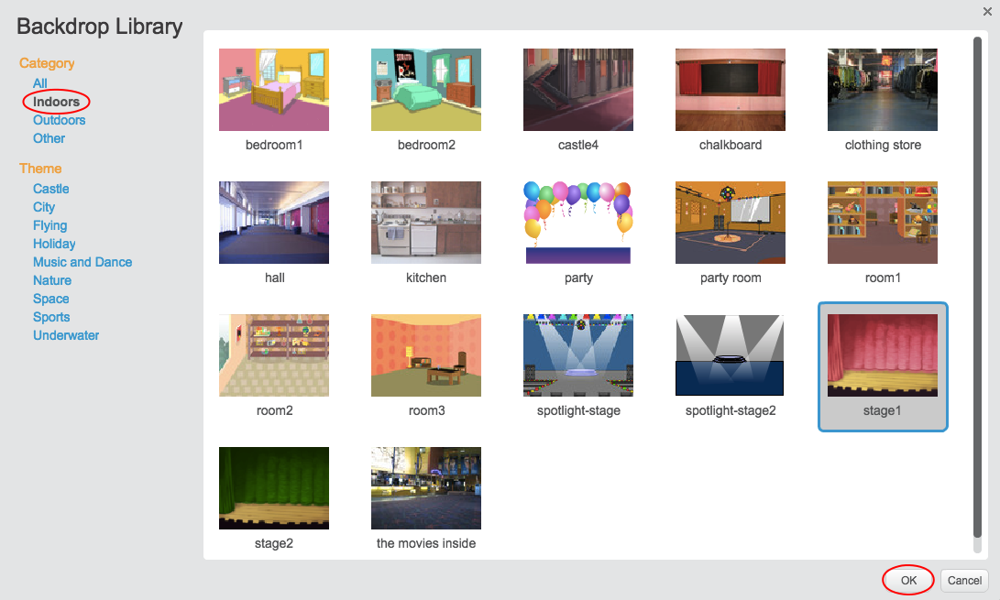

+ Klicken Sie auf | 123_8_0_321 | Wählen Sie Hintergrund aus der Bibliothek | 123_9_1_321 |.
    
    

+ Sie können Hintergründe nach Kategorie oder Thema durchsuchen. Klicken Sie auf einen Hintergrund und klicken Sie auf | 123_8_0_321 | OK | 123_9_1_321 |.
    
    